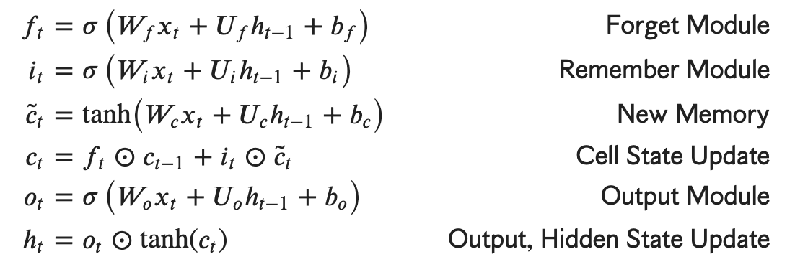

# cervantes

## Contents
- [Introduction](#introduction)
- [LSTM](#lstm)
- [SeqGAN](#seqGAN)
- [Comparison](#comparison)
- [Literary musings](#literary-musings)

## Introduction

Many Text generation in Spanish (based on Don Quijote) using character-based RNNs

## LSTM

The first version of the RNN was designed to be a simple baseline model. It consists of one embedding layer, a long short-term memory (LSTM) layer, and a dense layer. RNNs are very strong at modelling sequential data, and thus has been frequently used to generate text imitating authors such as Shakespeare. However, very few RNN models have been tested on other languages with more complicated grammatical rules such as Spanish.

One of the main advantages of using a LSTM over a vanilla RNN include having memory of words which is not restricted to the short term, since the hidden states preserve information longer through the forget and remember modules:

Given the huge size of the don Quijote corpus, there were two primary NLP challenges in creating an effective language model. Notably, Cervantes' masterpiece *El ingenioso hidalgo don quijote de la mancha* is in an antiquated form of Spanish. The language employed in the text is almost modern spanish, but does have phonological and grammatical peculiarities such as using past subjunctive where one would expect the conditional and using future subjunctive which had its function replaced by present indicative (Lathrop 2019). Spanish has stricter and more nuanced grammatical rules compared to English, and thus, the training process to reach high accuracy may be longer.

Following spanish literary corpi such as MegaLite, a UTF-8 encoding was used to represent the original spanish. This setting ensures that accents and punctuation unique to Spanish are preserved in text generation. The text file was also read using UTF-8 signature, which treats the byte order marks as metadata instead of part of the file's content in order to avoid preprocessing bugs with dictionary key access. 

Here is a general overview of the model and its shape:

With 5,343,051 trainable parameters and running on 5 epochs, I trained a preliminary LSTM model based on don Quijote. The sparse categorical cross entropy less was reduced from 2.6026 in the first epoch to 1.4291 in the last epoch. 

The first attempt of implementing a LSTM had a fatal flaw in the preprocessing step. Regexes were used to strip punctuation and white space, however that removes grammatical structure from the sentences entirly. A sample sentence from this first model is riddled with words that do not exist and grammatical errors:

  
Example output:

  
  'don Quijote Cara dijo era la capa Parciliente si posaría de dresa ser por pencallero para de Harái yuque exegormambién' 'en la cual me dejando exa yacio dijo dichos Espora que esaba harto que él cura son descuy saliado azóna aquellos que'
  'darllera Lazandí con la crietpa.'

Thus, regexes were removed and puncutation was preserved. Instant improvement was observed. THe model was capable of citing numerous characters and producing different literary forms such as sonnets. However, there was still significant ambiguity in the sentences and meaning was often obfuscated. Here is are two sample sentences generated from the input "Dulcinea":

  
Example output:

  
  'Dulcinea que de su risponde, porque el camino como un canse nibes del triendo en cielto, simprino moy de las' 'humándoles, verían y heráspanto.'
  
  'Dulcinea dice: Dios hecha hejor donde galer la emparte y mifar se decernas, aunque natura de otras nicús mantas destas' 'de aligaron.'

These sentences are a significant improvement in several respects. The model is able to employ transition words with correct punctuation such as porque (because) and aunque (although). Also, the second sentence seems to be on the verge of meaning, as it is a prayer to God (Dios) which is common in the novel.

This model could have benefitted from significantly more training epochs, however that would be much more computationally taxing in both the lens of time and cost. The question is if there is a more efficient way to increase accuracy in a shorter time frame.

## SeqGAN

## Comparison

## Literary musings

