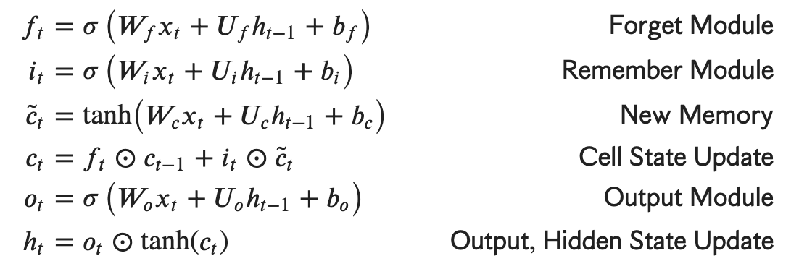
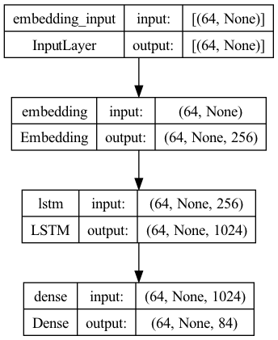
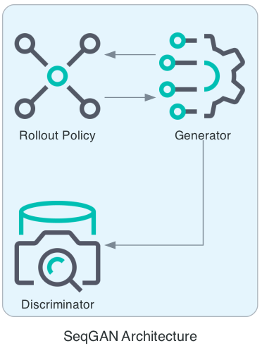

# cervantes

## Contents
- [Introduction](#introduction)
- [Long short-term memory](#vanillalstm)
- [SeqGAN](#seqGAN)
- [Comparison](#comparison)
- [Literary musings](#literary-musings)

## Introduction

Text generation in Spanish based on Don Quijote presents several unique and interesting challenges. This project experiments with a wide variety of neural text generation (NTG) techniques such as supervised learning through character-based Recurrent Neural Networks (RNNs) and reinforcement learning via unsupervised Generative Adversarial Networks or GANs for short (Goodfellow et al., 2014). To what extent of success can the literary style of Cervantes, the most widely read Spanish author in the world, be imitated and learned?

## VanillaLSTM

The first version of the model was designed to be a simple baseline. It consists of one embedding layer, a long short-term memory (LSTM) layer, and a dense layer. The VanillaLSTM is character-based precisely because sentences are generated one character at a time based on probability distributions predicting the next character.

One of the main advantages of using a LSTM over a basic RNN include having memory of words which are not restricted to the short term. In addition to the hidden state, there is a cell state which preserves information longer through the forget and remember modules. Pointwise multiplication by a mask vector is used to forget information while remembering is done through tanh and gating memory to contain only what we want to preserve long-term:



LSTMs are very strong at modelling sequential data, and thus has been frequently used to generate text imitating authors such as Shakespeare. However, very few such models have been tested on other languages with more complicated grammatical rules such as Spanish.

Given the huge size of the don Quijote corpus, there were two primary NLP challenges in creating an effective language model. Notably, Cervantes' masterpiece *El ingenioso hidalgo don Quijote de la Mancha* is in an antiquated form of Spanish (Lathrop 2019). The novel has several phonological and grammatical peculiarities:
- Using past subjunctive where one would expect the conditional
- Using future subjunctive which is now replaced by present indicative
- Employing passive voice and contractions prevalently

Spanish has stricter and more nuanced grammatical rules compared to English. There are **16 distinct tenses** which any Spanish verb can be conjugated into. Thus, the training process to reach high accuracy is undoubtly longer.

Following spanish literary corpi such as MegaLite, a UTF-8 encoding was used to represent the original spanish. This setting ensures that accents and punctuation unique to Spanish are preserved in text generation. The text file was also read using UTF-8 signature, which treats the byte order marks as metadata instead of part of the file's content in order to avoid preprocessing bugs with dictionary key access. 

Here is a **general overview** of the model and its shape:



With 5,343,051 trainable parameters and running on 5 epochs, I trained a preliminary LSTM model based on *don Quijote* using an Adam optimizer. The sparse categorical cross entropy loss was reduced from 2.6026 in the first epoch to 1.4291 in the last epoch. 

The first attempt of implementing a LSTM had a fatal flaw in the preprocessing step. Regexes were used to strip punctuation and white space, however that removes grammatical structure from the sentences entirly. A sample sentence from this first model is riddled with words that do not exist and grammatical errors:

<details>
  <summary>Example output:</summary>
  
  >```don Quijote Cara dijo era la capa Parciliente si posaría de dresa ser por pencallero para de Harái yuque exegormambién en la cual me dejando exa yacio dijo dichos Espora que esaba harto que él cura son descuy saliado azóna aquellos que darllera Lazandí con la crietpa.```

</details>

Therefore, regexes were removed and puncutation was preserved. Drastic improvement was observed. The model was capable of citing numerous characters (i.e. Camilla and don Fernando) and using different literary styles such as sonnets. However, there was still significant ambiguity in the sentences and meaning was often obfuscated. For example, here are two sample sentences generated from the input "Dulcinea":

<details>
  <summary>Example output:</summary>
  
  >```Dulcinea que de su risponde, porque el camino como un canse nibes del triendo en cielto, simprino moy de las humándoles, verían y heráspanto.```
  
  > ```Dulcinea dice: Dios hecha hejor donde galer la emparte y mifar se decernas, aunque natura de otras nicús mantas destas de aligaron.```

</details>

These sentences are a significant improvement in several respects. The model is able to employ conjuctions and transition words with correct punctuation such as porque (because) and aunque (although). Moreover, the second sentence seems to be on the verge of meaning (although it is still gibberish), as it starts with a prayer to God (Dios).

This model could have benefitted from significantly more training epochs, however that would be much more computationally taxing in both the framework of time and cost. The question thus is if there is a **more efficient way** to increase accuracy in a shorter time frame.

## SeqGAN

The Sequence Generative Adversarial Network consists of a generator and a discriminator which consists of one dense layer with sigmoid activation. After running 1000 batches, there was a memory allocation error due to the size of the dataset. In order to resolve this issue, the model's training ran on Brown's High Performance Computing Clusters, known as [OSCAR](https://docs.ccv.brown.edu/oscar/).

Here is a general diagram of how SeqGAN operates:


The Discriminator in the SeqGAN model uses pooling and applies dropout regularization for better generalization. Its metric is softmax cross-entropy loss with L2 regularization and is optimized with the Adams optimizer. The Generator creates sequences of tokens through a combination of an embedding layer, recurrent unit, and output unit. It then uses the Adam optimizer for training and applies gradient clipping. The Rollout class implements a rollout policy, a technique used in reinforcement learning to improve the performance of the Generator model by fine-tuning its output based on the feedback received from the Discriminator. With this policy, rewards are calculated to update the Generator's parameters.

With 120 pre-train epochs, the model pre-trained both the generator and discriminator, with test cross-entropy loss being reduced from 10.216 to 8.267.

## Comparison

## Literary musings


